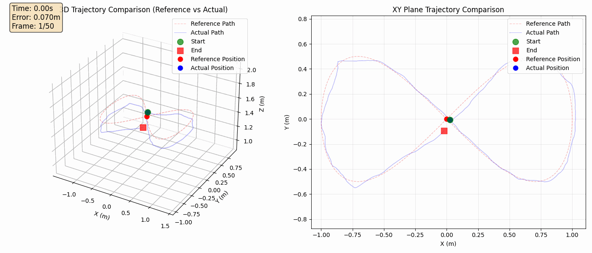
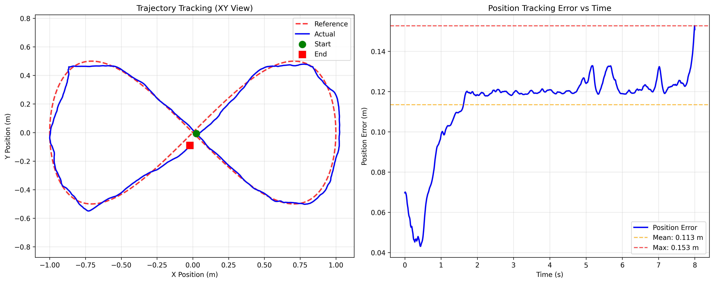
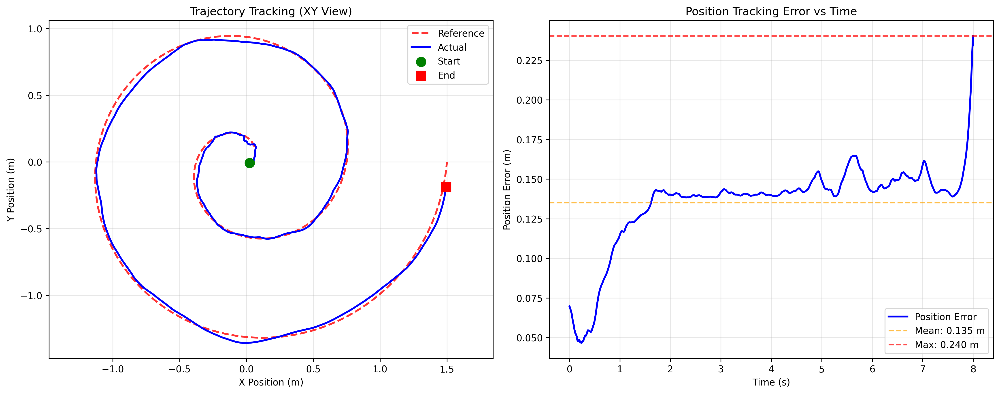

# Crazyflie TinyMPC Simulator

A comprehensive simulation framework for generating and testing Model Predictive Control (MPC) parameters for the Crazyflie nano quadcopter. This project provides tools for trajectory generation, parameter optimization, and visualization of control performance.

## Overview

This simulator generates TinyMPC parameters for various trajectory types and allows for detailed analysis of controller performance. It includes:

- **12 pre-defined trajectory types** for comprehensive testing
- **Real-time animated visualization** of reference vs actual trajectories  
- **Parameter optimization tools** for horizon and frequency tuning
- **Realistic noise modeling** for robust controller design
- **Support for both tracking and regulation control modes**

## Features

### Trajectory Types

The simulator supports various trajectory patterns to test different aspects of quadcopter control:

1. **Basic Trajectories**
   - `hover` - Stationary position holding
   - `circle` - Circular path in horizontal plane
   - `line` - Point-to-point linear motion
   - `landing` - Controlled descent from height

2. **Complex Maneuvers**
   - `figure8` - Figure-eight pattern for smooth transitions
   - `spiral` - Ascending/descending spiral motion
   - `zigzag` - Back-and-forth motion pattern
   - `rapid_zigzag` - High-speed directional changes

3. **Advanced Testing**
   - `waypoints` - Multi-point navigation
   - `step` - Step response testing
   - `acceleration` - Maximum acceleration tests
   - `constrained` - Obstacle avoidance scenarios

## Demo Gallery

### Animated Demonstrations

#### Figure-8 Trajectory Animation

*Real-time tracking performance: Smooth figure-8 pattern at 200Hz control frequency showing reference (red) vs actual (blue) trajectories*

### Static Trajectory Comparisons

#### Figure-8 Trajectory

*Complete figure-8 pattern showing 3D and XY plane views. Reference (red dashed) vs actual (blue solid) trajectories. Performance: RMSE 0.067m, Max error 0.153m at 200Hz*

#### Spiral Ascent Pattern

*3D spiral trajectory demonstrating simultaneous horizontal and vertical control. Shows excellent tracking of expanding radius with ascending motion*

## Quick Start

### Basic Usage

Generate parameters for a specific trajectory:

```bash
# Generate figure-8 trajectory at 200Hz
python generate.py figure8 --frequency 200 --horizon 50

# Create animated visualization
python generate.py circle --animate --frequency 200

# Save animation as GIF
python generate.py spiral --save-gif --gif-name my_trajectory.gif --max-frames 50
```

### Command Line Options

```bash
python generate.py [trajectory] [options]

Trajectories:
  hover, circle, figure8, line, spiral, landing, step, 
  zigzag, waypoints, acceleration, constrained, rapid_zigzag

Options:
  --frequency, -f      Control frequency in Hz (default: 50)
  --horizon, -H        MPC planning horizon (default: 50)  
  --mode, -m           Control mode: tracking or regulator
  --animate, -a        Show live animation
  --save-gif           Export animation as GIF
  --max-frames         Maximum frames for GIF (default: 150)
  --seed               Random seed for reproducibility
```

## Parameter Studies

Analyze the effect of control parameters on tracking performance:

```bash
# Run comprehensive parameter study
python parameter_study.py --trajectory figure8 --save-figure

# Test specific parameter ranges
python parameter_study.py --trajectory circle \
    --horizon-min 10 --horizon-max 100 \
    --freq-min 50 --freq-max 500 \
    --save-figure
```

## System Architecture

### State Space Model

The simulator uses a 12-state linearized model:
- **Position states**: x, y, z (meters)
- **Orientation states**: φ (roll), θ (pitch), ψ (yaw) (radians)
- **Linear velocities**: vx, vy, vz (m/s)
- **Angular velocities**: ωx, ωy, ωz (rad/s)

### Control Inputs

4 control inputs representing motor thrusts:
- u₁, u₂, u₃, u₄: Individual motor thrust commands (normalized)

### Physical Parameters

Based on the Crazyflie 2.x specifications:
- Mass: 36g
- Arm length: 46mm  
- Inertia: Ixx = Iyy = 1.43×10⁻⁵ kg·m², Izz = 2.89×10⁻⁵ kg·m²

## Performance Metrics

The simulator evaluates controller performance using:
- **Position Error**: RMS and maximum deviation from reference
- **Control Effort**: Average control input magnitude
- **Constraint Violations**: Number of limit breaches
- **Computational Cost**: Solver iterations and timing

## Noise Modeling

Realistic sensor noise is included:
- Position uncertainty: 5mm standard deviation
- Velocity estimation: 20mm/s standard deviation  
- IMU angle noise: 0.1° standard deviation
- Gyroscope noise: 0.6°/s standard deviation

## Output Files

Each simulation run generates:
- `simulation_results.png` - Static trajectory comparison plot
- System matrices (A, B, Q, R) for direct use in TinyMPC
- Performance metrics and verification results

## Requirements

- Python 3.7+
- NumPy
- Matplotlib  
- TinyMPC Python bindings

## Control Modes

### Tracking Mode
Traditional trajectory tracking where the controller follows a predefined path.

### Regulator Mode  
Each planning step regulates back to the origin, useful for disturbance rejection testing.

## Visualization Features

The animated visualizations include:
- **Dual view**: 3D trajectory and 2D top-down view
- **Real-time tracking**: Reference (red) vs actual (blue) positions
- **Error visualization**: Dynamic error lines between reference and actual
- **Trail effects**: Recent trajectory history
- **Performance metrics**: Live error magnitude display

## Advanced Features

### Custom Trajectories
Extend the framework by adding new trajectory types in `tinympc_generator.py`.

### Constraint Handling
Define position and input constraints for safe operation:
- Position bounds: ±5m horizontal, 0-5m vertical
- Input limits: ±0.5 normalized thrust

### Parameter Export
Generated parameters can be exported for use in:
- Embedded TinyMPC implementations
- MATLAB/Simulink models
- Hardware-in-the-loop testing

## Contributing

Contributions are welcome! Areas for improvement:
- Additional trajectory types
- Enhanced noise models
- Multi-drone formations
- Wind disturbance modeling

## License

This project is provided as-is for research and educational purposes.

## Acknowledgments

Built for the Crazyflie nano quadcopter platform by Bitcraze.